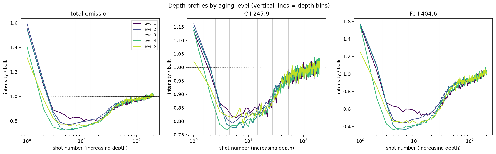

# LIBS 2026 — steel aging-state classification

Machine-learning workbench for the LIBS 2026 contest (Guangzhou): predict the
aging level (1–5) of a steel sample from its raw LIBS spectra.

The dataset holds 180 anonymised samples — 120 labelled for training, 60 for
submission. Each sample is one CSV with 12282 wavelengths (234.073–947.427 nm,
three overlapping Avantes channels) and 200 single-pulse spectra recorded at the
same position. Ranking is by classification accuracy on the 60 test samples.

## The 200 shots are a depth profile

All 200 pulses hit the *same spot*, so each one ablates deeper material: shot
number is a depth coordinate, not a replicate index. Steel ages from the surface
inwards, so the aging level shows up in how the spectrum changes from shot 1 to
shot 200. Two consequences run through the whole codebase:

- **Shot order is never destroyed.** Shots are not shuffled, and rejected
  outlier shots are repaired by interpolation instead of deleted, because
  deleting one would shift every later shot to a shallower apparent depth.
- **Depth is a modelling choice, not a detail.** `src/libs2026/depth.py` offers
  several encodings, from plain averaging (which throws depth away) to
  concatenated per-depth spectra, and `scripts/07_compare_encodings.py` compares
  them.

Measured on the training set (`scripts/08_depth_analysis.py`), the profile has
three regimes: a bright surface layer at shot 1 (1.4–1.9× bulk emission), a
pronounced minimum around shots 4–7 — the aged layer — and a bulk plateau from
roughly shot 100 onwards. The classes differ in the first ~20 shots and are
indistinguishable in the bulk, exactly as the physics predicts:



The depth of the dip is the clearest single signal: Cr I 425.4 nm falls to 0.59
of bulk for level 1 but 0.46 for level 4, and individual descriptors correlate
up to −0.28 with the aging level.

## Layout

```
pyproject.toml            dependencies and package metadata
uv.lock                   exact resolved versions (commit this)
configs/default.yaml      preprocessing, cross-validation and path settings
src/libs2026/             the library
  config.py               path resolution and YAML loading
  data.py                 CSV -> cached float32 .npy, label handling
  preprocessing.py        shot screening, SNIP baseline, normalisation
  features.py             sample-level feature matrices (+ caching)
  models.py               the classifier zoo, incl. a PLS-DA implementation
  evaluation.py           grouped stratified CV, sample-level scoring
  plotting.py             figures
scripts/                  numbered pipeline stages, run in order
cache/                    generated binary data (git-ignored)
results/                  metrics, figures, fitted models, OOF predictions
submissions/              contest-format CSVs
```

## Environment

The project is managed with [uv](https://docs.astral.sh/uv/). One command
creates `.venv`, installs the pinned dependencies from `uv.lock` and puts
`libs2026` on the path in editable mode:

```bash
uv sync --all-groups      # or: make setup
```

There is nothing to activate — prefix commands with `uv run`, which re-syncs the
environment first if `pyproject.toml` changed:

```bash
uv run python scripts/03_benchmark_models.py --n-jobs 12
uv run jupyter lab                       # notebooks/ (dev group)
```

Activate it the traditional way if you prefer: `source .venv/bin/activate`.

`uv.lock` pins every transitive version, so a colleague running `uv sync` gets
byte-identical packages. Add a dependency with `uv add <package>` rather than
editing `pyproject.toml` by hand, and refresh the pip fallback afterwards:

```bash
uv export --no-hashes --no-dev --no-emit-project > requirements.txt
```

`requirements.txt` is generated from the lockfile and exists only for people
without uv (`pip install -r requirements.txt`); do not edit it directly. The
scripts also still run under a bare system Python that happens to have the
dependencies installed, because `scripts/_bootstrap.py` puts `src/` on the path.

Linting uses ruff from the dev group: `make lint` (or `uv run ruff check src scripts`).

## Getting started

```bash
uv sync
uv run python scripts/01_prepare_data.py --n-jobs 12   # ~45 s, builds cache/ (1.8 GB)
uv run python scripts/02_explore_data.py --n-jobs 12
uv run python scripts/03_benchmark_models.py --n-jobs 12
```

`make all` runs the same three stages. Point `paths.raw_data` in
`configs/default.yaml` somewhere else if the released data move.

## Shots are a depth profile, not replicates

The 200 pulses of each sample are fired into **one spot**. Each successive shot
ablates deeper material, so shot index is a depth coordinate. Steel ages from
the surface inwards, and the spectrum therefore *changes* from shot 1 to shot
200 in a way that depends on the aging level:

* shot 1 — surface layer (~1.4–1.9× the bulk emission);
* shots ~3–10 — a pronounced minimum (the aged / oxidised layer). The depth of
  this dip is what separates the classes most clearly (e.g. Cr I 425.4 nm falls
  to ~0.59 of bulk for level 1 but to ~0.46 for level 4);
* shots ~100–200 — a plateau at the unaffected bulk composition.

See `results/figures/depth_profiles.png` and `scripts/08_depth_analysis.py`.

Consequences for the pipeline:

* Outlier shots are **repaired**, never deleted — dropping a shot would shift
  the depth axis of everything after it.
* Normalisation can be referenced to the bulk shots so intensity-vs-depth is
  preserved (`normalization_reference: bulk`).
* Depth bins are spaced **logarithmically** (fine near the surface).
* Feature encodings either keep depth explicitly (`mean_lines`, …) or use
  depth-aware augmentation (`augment: surface|blocks`). Treating the 200 shots
  as exchangeable replicates is wrong for this dataset.

## Pipeline stages

| Script | Purpose |
| --- | --- |
| `01_prepare_data.py` | Parses the 4.4 GB of CSVs once into memory-mappable arrays. |
| `02_explore_data.py` | Class-average spectra, PCA scores, shot-to-shot stability. |
| `03_benchmark_models.py` | Cross-validates the whole model zoo under one protocol. |
| `04_compare_preprocessing.py` | Crosses baseline × normalisation against reference models. |
| `05_tune_model.py` | Grid search for one model family, saves the best parameters. |
| `06_predict_submission.py` | Refits on all training data, writes a validated submission. |
| `07_compare_encodings.py` | Mean vs depth-aware encodings and augmentations. |
| `08_depth_analysis.py` | Depth profiles of diagnostic lines by aging level. |
| `09_benchmark_cnn.py` | 2-D CNN on `(shots × wavelengths)` images (needs `--extra cnn`). |
| `10_predict_cnn.py` | Fit the CNN and write a contest submission. |

## Methods being compared

`plsda` (PLS-DA, the chemometric reference), `pca_lda`, `pca_logreg`,
`pca_svm_rbf`, `svm_linear`, `pca_knn`, `pca_gnb`, `pca_mlp`, `random_forest`,
`extra_trees` and `hist_gbdt`. Each is a full scikit-learn pipeline starting
from the preprocessed spectrum, so scaling and PCA are refitted inside every
fold and cannot leak information.

## Two things that decide whether the numbers mean anything

**Sample-level, grouped validation.** All feature rows of one physical sample
must stay in the same fold. Scattering them across folds inflates accuracy.
`evaluation.py` uses `StratifiedGroupKFold` keyed on the sample, averages
predictions within a sample, and scores one vote per sample — exactly the
quantity the contest ranks. Results are averaged over several repeats because
a single 5-fold split of 120 samples is noisy.

**Class imbalance.** The training labels are far from uniform (13 / 40 / 40 /
14 / 13 for levels 1–5), so always-predict-level-2 already scores 33 %. Balanced
accuracy and macro-F1 are reported next to plain accuracy for this reason, and
most models use balanced class weights.

## Results so far

Cross-validated sample accuracy (5-fold grouped, 4 repeats), with the shipped
defaults — no baseline removal, per-channel L2 normalisation, four shot blocks
per sample:

| Model | accuracy | balanced accuracy | macro-F1 |
| --- | --- | --- | --- |
| `pca_mlp` | 0.715 ± 0.041 | 0.659 | 0.677 |
| `pca_svm_rbf` | 0.698 ± 0.025 | 0.600 | 0.638 |
| `hist_gbdt` | 0.673 ± 0.031 | 0.583 | 0.604 |
| `svm_linear` | 0.671 ± 0.025 | 0.617 | 0.643 |
| `pca_logreg` | 0.660 ± 0.031 | 0.631 | 0.642 |
| `pca_lda` | 0.637 ± 0.021 | 0.588 | 0.608 |
| `plsda` | 0.631 ± 0.038 | 0.550 | 0.581 |
| `pca_knn` | 0.548 ± 0.021 | 0.404 | 0.409 |
| `random_forest` | 0.533 ± 0.028 | 0.379 | 0.378 |
| `extra_trees` | 0.527 ± 0.019 | 0.358 | 0.344 |
| `pca_gnb` | 0.508 ± 0.023 | 0.439 | 0.450 |

Against a 33 % majority-class baseline. Numbers refer to the locked environment
(`uv.lock`); they move by a point or two on other scikit-learn versions, so
re-run the benchmark rather than trusting the table after an upgrade. Three
observations worth carrying forward:

- Skipping baseline removal beats SNIP by roughly five accuracy points across
  every reference model, so the plasma continuum is informative rather than
  nuisance. This is why `baseline: none` is the default.
- Splitting the 200 shots into four averaged blocks lifts most models
  (`pca_mlp` 0.64 → 0.72, `pca_svm_rbf` 0.64 → 0.70): four noisier training rows
  per sample beat one clean one when only 120 samples exist.
- Almost all remaining errors are confusions between *adjacent* aging levels
  (see `results/figures/confusion_g4_b1_pca_mlp.png`). Treating the target as
  ordinal rather than nominal is the most promising next step.

Wavelength binning (`--bin-factor 4`) cuts the feature count fourfold at no
accuracy cost, which is useful when a search would otherwise be too slow.

## 2-D CNN on depth-spectrum images

Each sample is kept as a single-channel image of shape
`(n_shots, n_wavelengths)` — rows are depth (shot order), columns are the
spectrum. A small CNN (`DepthSpectrumCNN`) learns local patterns that couple
the two axes (for example the aged-layer dip of a diagnostic line).

```bash
uv sync --extra cnn          # or: make setup-cnn
uv run --extra cnn python scripts/09_benchmark_cnn.py --bin-factor 8
# or: make cnn
```

Wavelengths are binned by default (`bin_factor=8` → ~1533 columns) so the
image stays tractable with only 120 training samples. Training uses class-
weighted cross-entropy, wavelength-shift / noise augmentation, and early
stopping. GPU is used automatically when available.

## Working with more rows per sample

`--n-groups k` with `--augment surface` (default) splits the *surface half* of
the depth profile into k consecutive blocks. That yields k training rows per
sample without inventing bulk-only rows that look like any class yet still
carry the aging label. `--augment blocks` uses the full 200-shot sequence
instead (stronger augmentation, more label noise at depth):

```bash
uv run python scripts/03_benchmark_models.py --n-groups 4 --n-jobs 12
uv run python scripts/07_compare_encodings.py --n-groups 4 --bin-factor 4
uv run python scripts/08_depth_analysis.py
```

## Producing a submission

```bash
python scripts/05_tune_model.py --model pca_svm_rbf --n-jobs 12
python scripts/06_predict_submission.py --model pca_svm_rbf \
    --params results/models/best_params_pca_svm_rbf.json
```

The submission script re-reports the cross-validated accuracy of the exact
configuration being shipped, then checks the CSV against the organisers' rules
(60 rows, no duplicates, integer labels 1–5, two columns) before writing it to
`submissions/`.

Send the final file to `libs2026@hjsmeeting.cn` before **31 October 2026**; one
submission per team.
