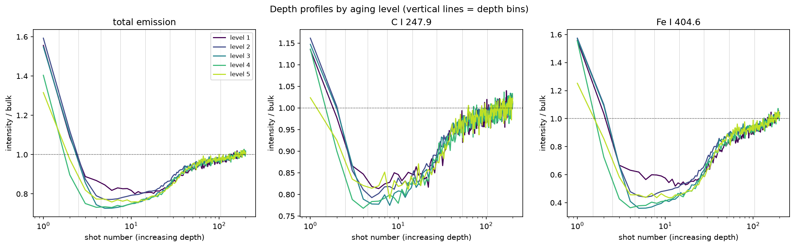

# LIBS 2026 — steel aging-state classification

Machine-learning workbench for the LIBS 2026 contest (Guangzhou): predict the
aging level (1–5) of a steel sample from its raw LIBS spectra.

The dataset holds 180 anonymised samples — 120 labelled for training, 60 for
submission. Each sample is one CSV with 12282 wavelengths (234.073–947.427 nm,
three overlapping Avantes channels) and 200 single-pulse spectra recorded at the
same position. Ranking is by classification accuracy on the 60 test samples.

## The 200 shots are a depth profile

All 200 pulses hit the *same spot*, so each one ablates deeper material: shot
number is a depth coordinate, not a replicate index. Steel ages from the surface
inwards, so the aging level shows up in how the spectrum changes from shot 1 to
shot 200. Two consequences run through the whole codebase:

- **Shot order is never destroyed.** Shots are not shuffled, and rejected
  outlier shots are repaired by interpolation instead of deleted, because
  deleting one would shift every later shot to a shallower apparent depth.
- **Depth is a modelling choice, not a detail.** `src/libs2026/depth.py` offers
  several encodings, from plain averaging (which throws depth away) to
  concatenated per-depth spectra, and `scripts/07_compare_encodings.py` compares
  them.

Measured on the training set (`scripts/08_depth_analysis.py`), the profile has
three regimes: a bright surface layer at shot 1 (1.4–1.9× bulk emission), a
pronounced minimum around shots 4–7 — the aged layer — and a bulk plateau from
roughly shot 100 onwards. The classes differ in the first ~20 shots and are
indistinguishable in the bulk, exactly as the physics predicts:



The depth of the dip is the clearest single signal: Cr I 425.4 nm falls to 0.59
of bulk for level 1 but 0.46 for level 4, and individual descriptors correlate
up to −0.28 with the aging level.

## Layout

```
pyproject.toml            dependencies and package metadata
uv.lock                   exact resolved versions (commit this)
configs/default.yaml      preprocessing, cross-validation and path settings
src/libs2026/             the library
  config.py               path resolution and YAML loading
  data.py                 CSV -> cached float32 .npy, label handling
  preprocessing.py        shot screening, SNIP baseline, normalisation
  features.py             sample-level feature matrices (+ caching)
  models.py               the classifier zoo, incl. a PLS-DA implementation
  images.py               (shots x wavelengths) image tensors for the CNN
  lines_db.py             theoretical line dictionary (Saha-Boltzmann)
  tokens.py               Voigt fits per line -> spectral-line tokens
  line_tokens.py          detected lines -> profile descriptors, line ranking
  cnn.py                  2-D CNNs over depth-spectrum images and tokens (torch)
  evaluation.py           grouped stratified CV, sample-level scoring
  plotting.py             figures
  bimamba.py              bidirectional Mamba over wavelength and depth (torch)
scripts/                  numbered pipeline stages, run in order
cache/                    generated binary data (git-ignored)
results/                  metrics, figures, fitted models, OOF predictions
submissions/              contest-format CSVs
```

Optional extras: `uv sync --extra cnn` for PyTorch, `uv sync --extra boosting` for XGBoost/LightGBM.
## Environment

The project is managed with [uv](https://docs.astral.sh/uv/). One command
creates `.venv`, installs the pinned dependencies from `uv.lock` and puts
`libs2026` on the path in editable mode:

```bash
uv sync --all-groups      # or: make setup
```

There is nothing to activate — prefix commands with `uv run`, which re-syncs the
environment first if `pyproject.toml` changed:

```bash
uv run python scripts/03_benchmark_models.py --n-jobs 12
uv run jupyter lab                       # notebooks/ (dev group)
```

Activate it the traditional way if you prefer: `source .venv/bin/activate`.

`uv.lock` pins every transitive version, so a colleague running `uv sync` gets
byte-identical packages. Add a dependency with `uv add <package>` rather than
editing `pyproject.toml` by hand, and refresh the pip fallback afterwards:

```bash
uv export --no-hashes --no-dev --no-emit-project > requirements.txt
```

`requirements.txt` is generated from the lockfile and exists only for people
without uv (`pip install -r requirements.txt`); do not edit it directly. The
scripts also still run under a bare system Python that happens to have the
dependencies installed, because `scripts/_bootstrap.py` puts `src/` on the path.

Linting uses ruff from the dev group: `make lint` (or `uv run ruff check src scripts`).

## Getting started

```bash
uv sync
uv run python scripts/01_prepare_data.py --n-jobs 12   # ~45 s, builds cache/ (1.8 GB)
uv run python scripts/02_explore_data.py --n-jobs 12
uv run python scripts/03_benchmark_models.py --n-jobs 12
```

`make all` runs the same three stages. Point `paths.raw_data` in
`configs/default.yaml` somewhere else if the released data move.

## Shots are a depth profile, not replicates

The 200 pulses of each sample are fired into **one spot**. Each successive shot
ablates deeper material, so shot index is a depth coordinate. Steel ages from
the surface inwards, and the spectrum therefore *changes* from shot 1 to shot
200 in a way that depends on the aging level:

* shot 1 — surface layer (~1.4–1.9× the bulk emission);
* shots ~3–10 — a pronounced minimum (the aged / oxidised layer). The depth of
  this dip is what separates the classes most clearly (e.g. Cr I 425.4 nm falls
  to ~0.59 of bulk for level 1 but to ~0.46 for level 4);
* shots ~100–200 — a plateau at the unaffected bulk composition.

See `results/figures/depth_profiles.png` and `scripts/08_depth_analysis.py`.

Consequences for the pipeline:

* Outlier shots are **repaired**, never deleted — dropping a shot would shift
  the depth axis of everything after it.
* Normalisation can be referenced to the bulk shots so intensity-vs-depth is
  preserved (`normalization_reference: bulk`).
* Depth bins are spaced **logarithmically** (fine near the surface).
* Feature encodings either keep depth explicitly (`mean_lines`, …) or use
  depth-aware augmentation (`augment: surface|blocks`). Treating the 200 shots
  as exchangeable replicates is wrong for this dataset.

## Pipeline stages

| Script | Purpose |
| --- | --- |
| `01_prepare_data.py` | Parses the 4.4 GB of CSVs once into memory-mappable arrays. |
| `02_explore_data.py` | Class-average spectra, PCA scores, shot-to-shot stability. |
| `03_benchmark_models.py` | Cross-validates the whole model zoo under one protocol. |
| `04_compare_preprocessing.py` | Crosses baseline × normalisation against reference models. |
| `05_tune_model.py` | Grid search for one model family, saves the best parameters. |
| `06_predict_submission.py` | Refits on all training data, writes a validated submission. |
| `07_compare_encodings.py` | Mean vs depth-aware encodings and augmentations. |
| `08_depth_analysis.py` | Depth profiles of diagnostic lines by aging level. |
| `09_benchmark_cnn.py` | 2-D CNN on `(shots × wavelengths)` images (needs `--extra cnn`). |
| `10_predict_cnn.py` | Fit the CNN and write a contest submission. |
| `11_tune_cnn.py` | GPU hyperparameter sweep for the pixel CNN. |
| `12_build_tokens.py` | Voigt-fits every spectral line into a token cache, with fit diagnostics. |
| `13_benchmark_token_cnn.py` | 2-D CNN over spectral-line tokens. |
| `14_predict_token_cnn.py` | Fit the token CNN (optionally blended) and write a submission. |

## Methods being compared

`plsda` (PLS-DA, the chemometric reference), `pca_lda`, `pca_logreg`,
`pca_svm_rbf`, `svm_linear`, `pca_knn`, `pca_gnb`, `pca_mlp`, `random_forest`,
`extra_trees` and `hist_gbdt`. Each is a full scikit-learn pipeline starting
from the preprocessed spectrum, so scaling and PCA are refitted inside every
fold and cannot leak information.

## Two things that decide whether the numbers mean anything

**Sample-level, grouped validation.** All feature rows of one physical sample
must stay in the same fold. Scattering them across folds inflates accuracy.
`evaluation.py` uses `StratifiedGroupKFold` keyed on the sample, averages
predictions within a sample, and scores one vote per sample — exactly the
quantity the contest ranks. Results are averaged over several repeats because
a single 5-fold split of 120 samples is noisy.

**Class imbalance.** The training labels are far from uniform (13 / 40 / 40 /
14 / 13 for levels 1–5), so always-predict-level-2 already scores 33 %. Balanced
accuracy and macro-F1 are reported next to plain accuracy for this reason, and
most models use balanced class weights.

## Results so far

Cross-validated sample accuracy (5-fold grouped, 4 repeats), with the shipped
defaults — no baseline removal, per-channel L2 normalisation, four shot blocks
per sample:

| Model | accuracy | balanced accuracy | macro-F1 |
| --- | --- | --- | --- |
| `pca_mlp` | 0.715 ± 0.041 | 0.659 | 0.677 |
| `pca_svm_rbf` | 0.698 ± 0.025 | 0.600 | 0.638 |
| `hist_gbdt` | 0.673 ± 0.031 | 0.583 | 0.604 |
| `svm_linear` | 0.671 ± 0.025 | 0.617 | 0.643 |
| `pca_logreg` | 0.660 ± 0.031 | 0.631 | 0.642 |
| `pca_lda` | 0.637 ± 0.021 | 0.588 | 0.608 |
| `plsda` | 0.631 ± 0.038 | 0.550 | 0.581 |
| `pca_knn` | 0.548 ± 0.021 | 0.404 | 0.409 |
| `random_forest` | 0.533 ± 0.028 | 0.379 | 0.378 |
| `extra_trees` | 0.527 ± 0.019 | 0.358 | 0.344 |
| `pca_gnb` | 0.508 ± 0.023 | 0.439 | 0.450 |

Against a 33 % majority-class baseline. Numbers refer to the locked environment
(`uv.lock`); they move by a point or two on other scikit-learn versions, so
re-run the benchmark rather than trusting the table after an upgrade. Three
observations worth carrying forward:

- Skipping baseline removal beats SNIP by roughly five accuracy points across
  every reference model, so the plasma continuum is informative rather than
  nuisance. This is why `baseline: none` is the default.
- Splitting the 200 shots into four averaged blocks lifts most models
  (`pca_mlp` 0.64 → 0.72, `pca_svm_rbf` 0.64 → 0.70): four noisier training rows
  per sample beat one clean one when only 120 samples exist.
- Almost all remaining errors are confusions between *adjacent* aging levels
  (see `results/figures/confusion_g4_b1_pca_mlp.png`). Treating the target as
  ordinal rather than nominal is the most promising next step.

Wavelength binning (`--bin-factor 4`) cuts the feature count fourfold at no
accuracy cost, which is useful when a search would otherwise be too slow.

## 2-D CNN on depth-spectrum images

Each sample is kept as a single-channel image — rows are depth (shot order),
columns are the spectrum — so a CNN can learn patterns that couple the two axes
(for example the aged-layer dip of a diagnostic line).

```bash
uv sync --extra cnn          # or: make setup-cnn
uv run --extra cnn python scripts/09_benchmark_cnn.py
# or: make cnn
```

Torch is pinned to the **CUDA 12.6** wheels (`torch==…+cu126` via the
`pytorch-cu126` index in `pyproject.toml`). That matches this host's NVIDIA
userspace (driver API 12.7 / libcuda 565.x). The default PyPI wheel is built
for CUDA 13.0 and refuses to initialise here.

GPU use still requires the NVIDIA *kernel* module to be loaded
(`nvidia-smi` must work). If `torch.cuda.is_available()` is `False` after
`uv sync --extra cnn`, ask an admin to load the driver on `pclibs-gpu`; the
Python side is already on a compatible build.

Practical details for a 120-sample training set:

* Wavelengths are binned (`--bin-factor 8`) and consecutive shots averaged
  (`--shot-bin 4`) → images of shape roughly `(50, 1533)`.
* Inside each CV fold every shot is projected onto a shared spectral PCA basis
  (`--spectral-pca 48`). Without that compression the CNN barely beats the
  majority-class baseline.
* Global average pooling is *not* used over the whole image — that would erase
  the depth axis. Wavelength is pooled away; a few depth bins are kept for the
  classifier head.
* Single-seed CV is noisy (~0.43–0.52). Averaging out-of-fold probabilities
  across 5 seeds recovers **~0.57** accuracy on CUDA
  (`--ensemble-seeds 42,7,123,99,2026`). Wider nets, mixup, and SE/residual
  extras consistently hurt with N=120.
* Tune with `uv run --extra cnn python scripts/11_tune_cnn.py --device cuda`.
  Write a submission with `scripts/10_predict_cnn.py` (loads
  `results/models/best_params_cnn2d.json` when present).
* Classical models (`pca_mlp` ~0.67) still lead alone; a 50/50 probability
  blend of the CNN ensemble with classical `pca_mlp` reached **~0.69** CV.

```bash
uv run --extra cnn python scripts/09_benchmark_cnn.py --device cuda --tag cnn2d_cuda_opt
uv run --extra cnn python scripts/10_predict_cnn.py --device cuda
```

## Spectral-line tokens

Instead of feeding 12282 wavelength bins (or a per-fold PCA of them) to the
CNN, each spectrum is rewritten as a sequence of **physical transitions**. A
theoretical line dictionary is ranked with a Saha-Boltzmann model over a
Te × Ne grid, then a Voigt profile is fitted at every surviving line centre.
The result is a `(16 channels × 50 depth rows × ~720 lines)` tensor: nine
static quantum-mechanical channels (wavelength, Ei/Ek, log gi/gk/Ak,
theoretical intensity, Z, ion stage) that are identical for every sample, plus
seven per-spectrum channels (amplitude, FWHM, R², Δλ, RMSE, fit-valid,
local continuum).

These measurements were taken in air, so the air line database
(`LIBS_data.db`) is required. The vacuum list is offset by ~0.07–0.12 nm —
larger than a detector pixel — and measurably worse (12.1 % valid fits /
0.119 nm median |Δλ| against 16.8 % / 0.047 nm for air under identical
settings). Two further filters keep a token pinned to its own transition:

* lines closer than two detector pixels are collapsed to the theoretically
  strongest member of the blend (722 lines remain from 1005);
* the fitted centroid may not walk more than 1.5 pixels from the theoretical
  wavelength, otherwise the Voigt claims a neighbour.

```bash
uv run python scripts/12_build_tokens.py --n-jobs 23
uv run --extra cnn python scripts/13_benchmark_token_cnn.py --device cuda
uv run --extra cnn python scripts/14_predict_token_cnn.py --device cuda
# or: make tokens && make token-cnn && make token-submit
```

`12_build_tokens.py` reports per-element line counts, the valid-fit fraction
and a |Δλ| histogram (`results/figures/token_diagnostics.png`). On the
training set 57 % of tokens converge, median |Δλ| is 0.056 nm, and H, N, O, Cr
are detected in almost every spectrum.

Grouped 5-fold, 5-seed ensemble (the same protocol as the pixel CNN):

| Model | accuracy | notes |
| --- | --- | --- |
| Token CNN, 722 lines, shot-norm | **0.542** | 5 seeds × 2 repeats; seed mean 0.50 ± 0.03 |
| Token CNN, 722 lines, bulk-norm | 0.525 | same protocol; shot-norm wins the sweep |
| Token CNN, top-250 lines | 0.542 | 3-seed bulk ablation; matches shot-norm with fewer columns |
| Amplitude-only tokens | 0.333 | Voigt extras and static channels do earn their place |
| `pca_mlp` on token amplitudes | 0.421 ± 0.025 | 2-D structure of the token image matters |
| Pixel CNN (wavelength PCA) | 0.575 | previous best neural model |
| Classical `pca_mlp` | 0.715 ± 0.041 | still the leader |

The token CNN does not beat the pixel CNN or the classical model on its own.
A 50/50 probability blend with classical `pca_mlp` reaches **0.723 ± 0.033**,
a small lift over classical alone (0.715). Mixing with the pixel CNN at
weight 0.6 token / 0.4 pixel reaches 0.608, between the two neural models.

`scripts/14_predict_token_cnn.py` loads `results/models/best_params_token_cnn.json`
and, unless overridden, applies that 50/50 blend on the test set.

## Working with more rows per sample

`--n-groups k` with `--augment surface` (default) splits the *surface half* of
the depth profile into k consecutive blocks. That yields k training rows per
sample without inventing bulk-only rows that look like any class yet still
carry the aging label. `--augment blocks` uses the full 200-shot sequence
instead (stronger augmentation, more label noise at depth):

```bash
uv run python scripts/03_benchmark_models.py --n-groups 4 --n-jobs 12
uv run python scripts/07_compare_encodings.py --n-groups 4 --bin-factor 4
uv run python scripts/08_depth_analysis.py
```

## Producing a submission

```bash
python scripts/05_tune_model.py --model pca_svm_rbf --n-jobs 12
python scripts/06_predict_submission.py --model pca_svm_rbf \
    --params results/models/best_params_pca_svm_rbf.json
```

The submission script re-reports the cross-validated accuracy of the exact
configuration being shipped, then checks the CSV against the organisers' rules
(60 rows, no duplicates, integer labels 1–5, two columns) before writing it to
`submissions/`.

Send the final file to `libs2026@hjsmeeting.cn` before **31 October 2026**; one
submission per team.

## Spectral CNN and depth transformer

The new experiment learns an embedding for each spectrum with shared 1-D CNNs,
models the depth sequence with a compact transformer, and classifies samples
with an end-to-end MLP. It includes pooling-only and depth-CNN controls on
identical grouped folds, inner-validation early stopping, and saved recipes
for consistent final refitting. See [architecture, commands, and validation
details](docs/depth_transformer.md).

```bash
uv run --extra cnn python scripts/15_depth_transformer.py benchmark --device cuda --tag initial
```

Synthetic tests verify the implementation; contest accuracy must be measured
on the training host with the actual spectral data.

## Transformer autoencoder + CLS MLP

A sibling experiment reconstructs the same raw depth sequences with a
Transformer encoder (sinusoidal wavelength PE, glued CLS) and classifies from
the CLS state with an MLP against 5-dim one-hot targets. See
[docs/autotransformer.md](docs/autotransformer.md).

```bash
uv run --extra cnn python scripts/16_autotransformer.py benchmark --device cuda --tag initial
```

## Fe plasma temperature (Boltzmann plot)

`scripts/20_boltzmann_temperature.py` (library: `src/libs2026/boltzmann.py`)
measures the Fe I excitation temperature of every sample and depth bin, plus
n_e from the H-alpha Stark width. Fe I lines come from the air database, are
screened for blends, self-absorption and implausible assignments, and are
reduced to the combination that lies on one straight Boltzmann line.

* The three channels are not cross-calibrated (UV lines sit ~5 ln units below
  visible ones), so lines are taken from channel 2 only and a linear
  ln-response in wavelength is fitted jointly with all Boltzmann plots.
* Result: 18 Fe I lines, E_k 3.2–6.7 eV, median R² 0.991, T ≈ 7,960 K.
  T decreases with aging level (Spearman ρ = −0.26, p = 0.004); n_e rises
  (ρ = +0.42, p = 1.5e-6).
* Saha-Boltzmann is skipped: with the 1 ms gate no Fe II line in channel 2 is
  both measurable and plausibly assigned.

```bash
uv run python scripts/20_boltzmann_temperature.py --db /path/to/LIBS_data.db
```

## AE CLS + PCA + MLP fusion

Concatenate frozen autoencoder CLS embeddings (broadcast onto `n_groups=4`
classical rows) with PCA scores from `mean_lines`, then classify with an MLP.
See [docs/ae_pca_mlp.md](docs/ae_pca_mlp.md).

```bash
uv run --extra cnn python scripts/17_ae_pca_mlp.py benchmark --device cuda --tag g4_broadcast
```

## Bidirectional Mamba (spectral + depth pathways)

A selective state-space model on the same depth sequences as the depth
transformer: one bidirectional Mamba block reads the region-pooled spectrum as
279 wavelength patches, another reads the 65 depth tokens, and learned queries
with a content gate fuse the two paths before a three-head logit ensemble, all
trained end to end at a cost linear in sequence length. The benchmark runs on
the original and the corrected labels over identical folds. See
[docs/bimamba.md](docs/bimamba.md).

```bash
uv run --extra cnn python scripts/33_bimamba.py benchmark --device cuda --labels both --tag initial
```

## Data-driven line tokens: which lines carry the aging signal

`scripts/31_line_tokens.py` (library: `src/libs2026/line_tokens.py`) takes the
10 nm occlusion map of `scripts/27` down to single emission lines. Lines come
from the measured spectrum, not from a theoretical dictionary. Each line is
described in every 20-shot depth block, and lines are ranked by how much a
classifier relies on them.

* **Detection** on the training mean spectrum. A [1, 2, 1] / 4 kernel first
  cancels the detectors' fixed even/odd pixel pattern (±10–15 %, strongest on
  channel 3). Each wavelength is taken from one channel only (overlaps are
  split at their midpoint). A peak must rise 5 noise sigmas within 21 pixels,
  which lets through about 0.1 noise peaks per 1000 pixels. Result: 274 lines
  (131 / 92 / 51 per channel).
* **Tentative assignment** against the air line database. A per-channel
  calibration offset is fitted on the strongest peaks (−0.034 / −0.052 /
  −0.050 nm), and candidates are ranked by Saha-Boltzmann intensity with
  abundance priors. 268 of 274 lines are assigned; `n_competing` and
  `alternatives` flag blends.
* **Tokens** hold 8 descriptors per line and depth block: area, height, width,
  centroid shift, asymmetry, detected, continuum and continuum slope, shaped
  `(samples, 10 blocks, lines, 8)`. The layout follows `tokens.py`, so
  `TokenCNN(**tokens.cnn_kwargs(), ...)` can read them.
* **Ranking** occludes one line's descriptors out-of-fold, inside a recursive
  elimination: the weakest 30 % of lines are dropped, the rest re-ranked, so
  redundant lines do not shield each other.

Same grouped folds for every row (10 repeats), `pca_mlp` on the 10 depth blocks:

| Representation | features | accuracy |
| --- | --- | --- |
| full spectrum | 12282 | 0.735 ± 0.026 |
| 274 lines, all descriptors | 2192 | 0.708 ± 0.026 |
| line only (no continuum) | 1644 | 0.694 ± 0.024 |
| shape: width, shift, asymmetry | 822 | 0.684 ± 0.023 |
| intensity: area, height | 548 | 0.634 ± 0.025 |
| continuum: level, slope | 548 | 0.604 ± 0.032 |

Accuracy of a K-line token set, with the lines ranked inside every training
fold only (nested), against K random lines:

| lines | 10 | 20 | 40 | 80 | 150 | 250 |
| --- | --- | --- | --- | --- | --- | --- |
| selected | 0.649 | 0.657 | 0.655 | 0.680 | 0.695 | 0.715 |
| random | 0.588 | 0.594 | 0.629 | 0.654 | 0.682 | 0.718 |

What this says about the spectra:

- **Line shape matters more than line intensity.** Width, shift and asymmetry
  alone (0.684) beat area and height (0.634). This is not a calibration drift:
  removing each sample's common-mode line shift leaves per-line separability
  unchanged.
- **The valuable lines are self-absorption- and Stark-sensitive.** The top
  line is H-alpha 656.3 nm, through its centroid shift, which orders the
  levels 5 > 3–4 > 2 > 1 at every depth. It is in the top 80 of 94 % of
  nested folds. Next come the strong, low-lying Fe I lines of 340–390 nm
  (371.99, 374.56, 375.82, 364.78, 349.78, 357.01, 387.86, 385.99 nm),
  N I 939.3 (width) and Cr I 435.2; 62 of the 80 selected lines sit on
  channel 1. Selected Fe I lines start from lower levels than the unselected
  ones (median E_i 0.96 vs 1.58 eV, Mann-Whitney p = 3e-4) at the same
  signal-to-noise, i.e. they are the lines most prone to self-absorption.
  Together with the Stark-sensitive H-alpha and N I lines, this points to the
  aging level acting through plasma conditions (optical depth, electron
  density; cf. n_e ρ = +0.42 in the Boltzmann analysis) more than through
  composition.
- **The information is spread out.** Ranked selection beats random lines by
  about 6 points at 10–20 lines; the advantage is gone by 250. The default
  export of 80 lines (640 features) keeps 0.680.
- **Pixel and line importance only weakly agree.** Summed per 10 nm window,
  line importance correlates only weakly with the pixel occlusion of
  `scripts/27` (Spearman +0.13). Blanking pixels mostly removes intensity,
  while the token model relies on line shape.

The full-spectrum reference is re-run on the same folds: 0.735 here. The 0.752
stored by `scripts/27`–`29` does not reproduce in the current environment;
`scripts/29`'s own CV code gives 0.734 on the same seeds.

```bash
uv run python scripts/31_line_tokens.py --n-repeats 10 --n-jobs 10   # ~3 min; or: make line-tokens
uv run python scripts/31_line_tokens.py --labels corrected           # scripts/29 label corrections
uv run python -m unittest tests.test_line_tokens -v
```

Outputs: `results/metrics/line_tokens_lines.csv` (every line with geometry,
assignment, rank, nested selection frequency, depth-resolved occlusion and the
descriptor that best separates the levels), `line_tokens_benchmark.csv`,
`line_tokens_selection.csv`, the figures `results/figures/line_tokens_*.png`,
and the selected tokens in `cache/line_tokens/selected_top80.npz`:

```python
from libs2026 import LineTokens
tokens = LineTokens.load("cache/line_tokens/selected_top80.npz")   # lines ordered by rank
X_rows, y_rows, groups, ids = tokens.subset("train").rows()        # (1200, 80 * 8) for sklearn
```

### One signal area per line (`scripts/32_line_areas.py`)

The same 274 lines are each reduced to a single number per depth block: the
signal area between b1 and b2, the nearest inflection points left and right of
the line centre. The bounds are found once on the smoothed training mean
spectrum and are then fixed for every spectrum, like the `b1_w`/`b2_w` windows
of `context/LIBSmethods.py`. For a Gaussian line they sit at ±σ, so b1..b2 is
narrower than the line: a median of 3 px, about 0.8 × FWHM. The line windows
are written to `results/metrics/line_areas_windows.csv`.

Same folds as above, 10 repeats, MLP(128, 64) on 274 areas:

| Area | MLP, no PCA | PCA(30) + MLP | PCA(120) + MLP |
| --- | --- | --- | --- |
| inflection, linear baseline | 0.572 | 0.557 | 0.623 |
| inflection, LIBSmethods formula | 0.623 | 0.630 | 0.624 |
| valleys (whole line), linear baseline | 0.569 | 0.574 | 0.593 |
| *full spectrum, PCA(30) + MLP* | | *0.735* | |

- **One area per line recovers only part of the signal**, about 0.57–0.63 against 0.735.
  Balanced accuracy is lower still (0.47–0.58): the areas mostly
  separate the two large classes (levels 2 and 3).
- **Tuning doesn't close the gap.** Varying the MLP penalty (1e-3 to 10) or the
  PCA width keeps the areas between 0.43 and 0.63. A few principal components
  (5–20: 0.43–0.51) do worse than none, so the largest-variance directions of
  the areas are not the class-relevant ones.
- **The `LIBSmethods` formula scores highest partly by accident.** Its baseline
  term is one pixel wide, not `b2 - b1` pixels, so the continuum under the line
  stays in the "area". The continuum carries class information on its own.
- **Window choice barely matters.** Inflection and valley bounds give about the
  same accuracy. What the classifier needs, and a single area throws away, is
  the line shape and the continuum (see the descriptor table above).

```bash
uv run python scripts/32_line_areas.py --n-repeats 10 --n-jobs 10   # ~35 s; or: make line-areas
```
